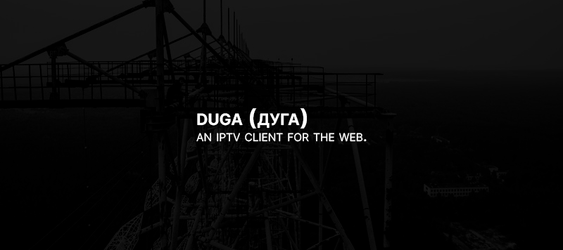

### **duga (дуга)** is an IPTV client for the web.

Its name pays homage to [Duga](https://en.wikipedia.org/wiki/Duga_radar), an over-the-horizon radar system used in the Soviet Union as part of its early-warning radar network for missile defense. Two operational duga radars were deployed, with one near Chernobyl and Liubech in the Ukrainian SSR, and the other in eastern Siberia.

> [!WARNING]  
> duga is a work in progress. At the moment, VODs and Series are not supported.

## Getting Started

1. Clone the repository:

```sh
git clone https://github.com/carlos-menezes/duga.git
```

2. Install the dependencies:

```sh
pnpm install
```

3. Run the application:

```sh
pnpm dev
```
